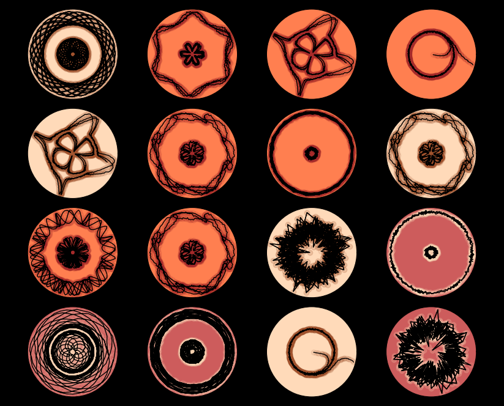
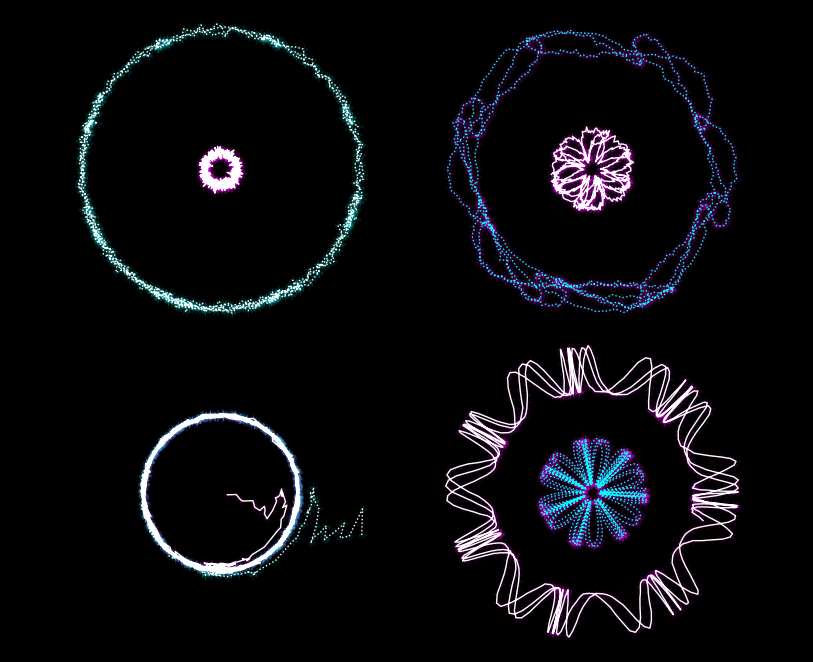
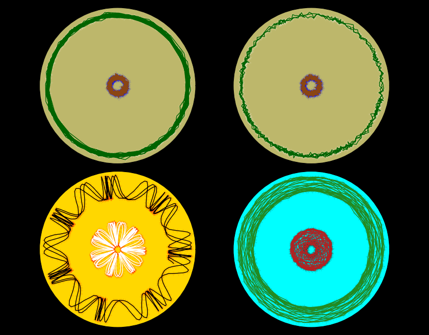

# SimpleArtGenerator
I really know little to nothing about generative art, at the moment of the creation of this repository. I know way more stuff about physics, dynamics and phase spaces. In fact, the following figures are nothing else than polar phase spaces, where the phase of the oscillator is plotted along the angular direction and its istantaneous speed is represented by the radial length. Eventually, noise have been added during the integration of the model (the Kuramoto model, that I briefly explore in this[link] repo).  
The data employed as the base of this code are a set of solutions of the Kuramoto model with 2 oscillators, for different parameters (natural frequencies, coupling and temperature). In fact the "Data" csv contains 7 couples of angular functions from which the speed can be easily computed. In order to enrich the number of possible combinations, the original structure is not respected: solutions for different parameters can be plotted togheter and even the phase-speed couples can be mismatched.   
Three different custom color palettes have been created (thanks to which I feel really confortable now with the default and quite rich color palette of matplotlib). Once the palette is selected, one of its fixed options is extracted for each individual plot.  
There's nothing else to add. That's really a simple art generator.  
  
Palette 1  
Inspiration: **Native Americans**

  
Palette 2  
Inspiration: **Electricity** spells of some fantasy game, let's say Skyrim 

Palette 3  
Inspiration: the colours represent the **sun**, the **aquatic plants** and the **terrestrial plants**

